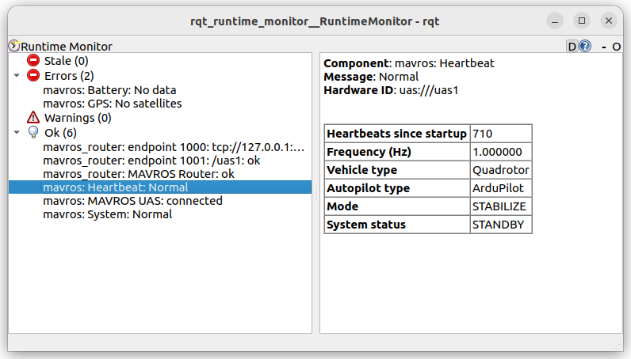

# apm_bringup
Package contain script to run ardupilot in sitl and gazebo simulation

Usage tmuxp config file for run multiple scripts and ros2 command/launch in dedicate pans

## Scripts

| name  | desc  | comp  |
|---|---|---|
| apm_time_sync  | run sitl with BRD_RTC_TYPES  | gazebo, sitl (launch), mavproxy, mavros  |
| iris_ardupilot |  | gazebo, sitl (launch), mavproxy, mavros  |
| sitl_only | run only sitl for debug without gazebo | sim_vehicle |
| sitl_with_mavros | 


---

## Demo
tmuxp yaml to launch sitl without gazebo simulation

### helper script and alias to set ardupilot environment
```bash
#!/bin/zsh

echo $PATH | grep -q /git/ardupilot/Tools/autotest

if [ $? -eq 0 ]; then
  echo apm_is_set
else
  export PATH=$PATH:$HOME/git/ardupilot/Tools/autotest
fi
```

```yaml
session_name: apm
windows:
  - window_name: dev window
    layout: tiled
    shell_command_before:
      - apm # alias source apm.sh
    panes:
      - shell_command:
          - sim_vehicle.py  -v ArduCopter -f quad -D --no-mavproxy
```

```python title="minimal example"
from pymavlink import mavutil

master = mavutil.mavlink_connection("tcp:127.0.0.1:5760")
master.wait_heartbeat()

while True:
    msg = master.recv_match()
    if not msg:
        continue
    print(msg.to_dict())
```

---

## mavros

!!! note "disable fcu_url from config"
     To control fcu_url param from command disable it in param file
    ```yaml
    # /mavros_node:
    #   ros__parameters:
    #     fcu_url: udp://127.0.0.1:14551@
    ```

## run mavros
```
ros2 run mavros mavros_node --ros-args -p fcu_url:=tcp://127.0.0.1:5760@ --params-file ~/apm_ws/src/apm_bringup/config/apm_config.yaml
```

!!! note "sitl"
    Running SITL without streams settings from parameters or ``
    Send only `HEARTBEAT` mavlink message

### Diagnostics
mavros `sys_status` plugin send heartbeat and others diagnostics telemetry via ros `/diagnostic` topic
For GUI view install `ros-humble-rqt-runtime-monitor`and run

```
ros2 run rqt_runtime_monitor rqt_runtime_monitor
```


     